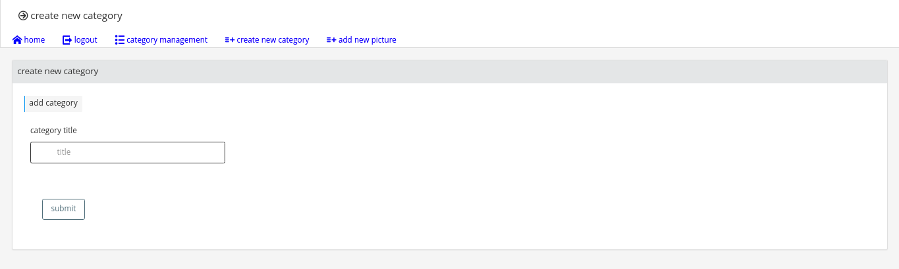
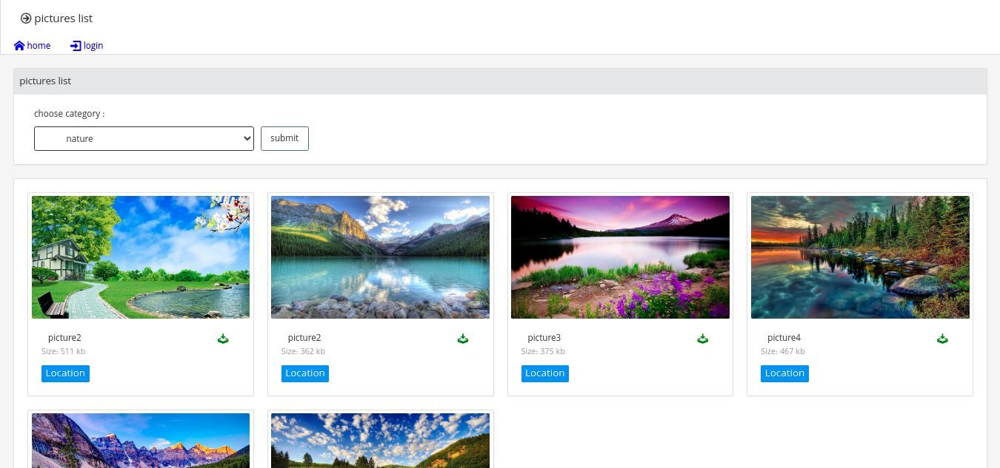
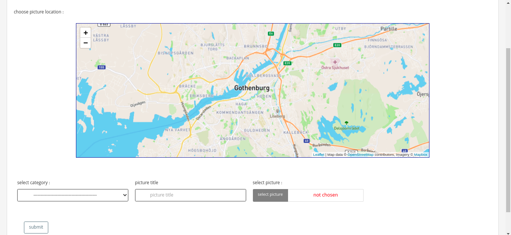

# Photo Album
This simple photo album website is for a photographer(admin) to upload him/her photos in order to users can see them.
<h2>Some Pages Of Website:</h2>

<h4>Add Category</h4>

<h4>Show All Photos</h4>

<h4>Add Photo</h4>

<h2>Technologies used:</h2>

 <h3>HTML</h3> - to create web pages.
 <h3>CSS</h3> - to styling.
 <h3>JavaScript</h3> - to to create dynamically updating content.
 <h3>Python</h3> - to handle the 'behind-the-scenes' functionality of website.
 <h3>Django</h3> - to assist in development, providing standard, low-level functionality.
 <h3>Docker</h3> - for developing, shipping, and running application and also deliver software quickly.
 <h3>Bootstrap</h3>
 <h3>jQuery</h3>
 
 
 
 <h2>Features & Pages</h2>

The website consists of 6 unique pages:

- Homepage : 
 - users can select category and see all photos assigned to selected category, download photo if they like, see the location of photo. 

- Login Page 
- Add New Picture : 
 - admin can add new photo . 

- Add Category : 
 - admin can add new category . 

- Category Management : 
 - admin can see all created categories and delete them . 

 

